Nakama Unreal
=============

[Nakama](https://github.com/heroiclabs/nakama) is an open-source server designed to power modern games and apps. Features include user accounts, chat, social, matchmaker, realtime multiplayer, and much [more](https://heroiclabs.com/nakama).

This client implements the full Nakama API and socket options with the server, as well as the [Satori](https://heroiclabs.com/docs/satori/concepts/introduction/index.html) API.  
It's written in C++ with minimal dependencies to support Unreal 4 and 5.

If you experience any issues with the client, it can be useful to enable debug logs and [open an issue](https://github.com/heroiclabs/nakama-unreal/issues).

The plugin documentation including Getting Started and Code Examples is online at [https://heroiclabs.com/docs/unreal-client-guide/](https://heroiclabs.com/docs/unreal-client-guide/).

For all other docs, check out [https://heroiclabs.com/docs](https://heroiclabs.com/docs).

# General Information

This plugin can also be used for programmers who like C++ or Blueprints. All variables and functions are exposed to types used by Unreal Engine (UPROPERTIES, USTRUCT, UFUNCTIONS etc.)

The plugin is divided into three modules which can be pulled in depending on your needs.

- `Nakama` High-level Nakama API: The recommended C++-based module for using Nakama in UnrealEngine.
- `NakamaApi` Low-level Nakama API: Required for the `Nakama` module, but not recommended for direct use.
- `NakamaBlueprints` For users who would prefer to use Blueprints in their project.

# Getting Started

You'll need to set up the server and database before you can connect with the client. The simplest way is to use Docker but have a look at the [server documentation](https://github.com/heroiclabs/nakama#getting-started) for other options.

To get started using Nakama in Unreal you will need the following:

1. Install and run the servers. Follow these [instructions](https://heroiclabs.com/docs/nakama/getting-started/install/docker/).
2. A copy of the [Nakama Client](https://github.com/heroiclabs/nakama-unreal/releases) plugin
3. [Unreal Engine](https://www.unrealengine.com) 4.25 or greater or 5.
4. A compiler for the platform you are developing on, such as [Visual Studio](https://www.visualstudio.com/vs/community/) on Windows or [XCode](https://developer.apple.com/xcode/download/) on OSX.

Also, please ensure your Unreal project is a C++ project.  If it is Blueprint only, you can add a new C++ file to your project in Unreal Editor via "File -> New C++ Class".  Set it private and name it whatever you like.  Having this file in your project lets Unreal compile the plugin.

## Installing the Plugin

To use Nakama in your Unreal project, you'll need to copy the Nakama Client files you downloaded into the appropriate place:

1. Open your Unreal project folder (for example, `C:\\MyUnrealProject\\`) in Explorer or Finder.
2. If one does not already exist, create a `Plugins` folder here.
3. Copy the `Nakama` folder from the root of the downloaded release zip and put it in the `Plugins` folder.

**Optionally:** you can put the plugin inside your Unreal Engine plugin folder (for example, `C:\Program Files\Epic Games\UE_4.26\Engine\Plugins\`) to use the plugin across multiple projects.

Remember to add the modules to the dependencies under your project's Build.cs file. For example:

```cs
PublicDependencyModuleNames.AddRange(new string[] { "Nakama", "NakamaApi", "NakamaBlueprints" });
```

At this point, you are done. Restart Unreal. After it compiles everything, open Edit->Plugins, then search for "Nakama". If all went well, you should see the Nakama plugin, make sure to enable it (this may prompt an editor restart).

# Example Usage

There's a variety of ways to authenticate with the server. Authentication can create a user if they don't already exist with those credentials. It's also easy to authenticate with a social profile from Google Play Games, Facebook, Game Center, etc.

1. Create the Nakama Client Config using your desired connection credentials:

```cpp
const FString ServerKey = TEXT("defaultkey");
const FString Host = TEXT("127.0.0.1");
constexpr int32 Port = 7350;
constexpr bool bUseSSL = false;

const FNakamaClientConfig ClientConfig = FNakamaClientConfig{ServerKey, Host, Port, bUseSSL};
```

2. Authenticate using the previously created Nakama Client Config along with the device's Id, desired username, and whether to create a new account if this user doesn't exist:

```cpp
FNakamaSession Session;

const FString DeviceId = TEXT("<DeviceId>");
const FString Username = TEXT("NewUser");
constexpr bool bCreate = true;

Nakama::AuthenticateDevice(ClientConfig, bCreate, Username, DeviceId).Next(
    [&Session](const FNakamaSessionResult& AuthenticateResult)
    {
       if (AuthenticateResult.bIsError)
       {
          UE_LOG(LogTemp, Error, TEXT("Failed to log in: %s"), *AuthenticateResult.Error.Message);
          return;
       }

       Session = AuthenticateResult.Value;

       UE_LOG(LogTemp, Log, TEXT("Log in successful: %s"), *AuthenticateResult.Value.Username);
    });
```

3. Once the user is authenticated, you can start making API requests by passing in both the Nakama Client Config, and the session that was received from authentication:

```cpp
Nakama::GetAccount(ClientConfig, Session).Next([](const FNakamaAccountResult& AccountResult)
{
    if (AccountResult.bIsError)
    {
       UE_LOG(LogTemp, Error, TEXT("An error occurred: %d:%s"), AccountResult.Error.Code,
              *AccountResult.Error.Message);
    }
});
```

# Getting Started with `NakamaBlueprints`

In this section you will learn how to manually create and manage Nakama clients that are provided by this plugin, entirely in blueprints.

It is up to the you where to create and store references to the clients, this could be done in any actor, component, character, gamemode etc. A good place to put the clients is in the Game Instance.

Start by adding the Make Nakama Client Config node which is a part fo the Nakama Library.

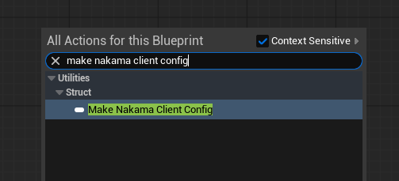

It is good practice to promote the clients to variables so you can access them in other places in your blueprint graphs.

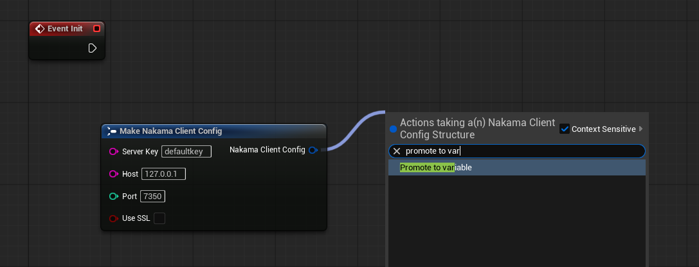

You are now ready to authenticate using one of the many provided Nakama authentication types, in this example we will be authenticating with email and password. Normally you would setup a Widget Blueprint and pass the input from the UI into the authentication node, and then authenticate by pressing a log-in button.

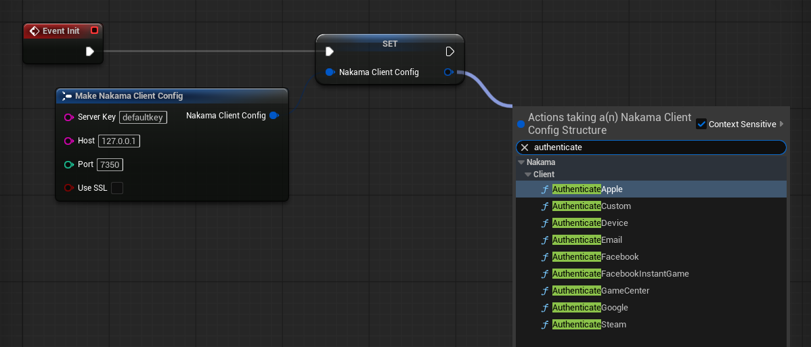

As you can see, this returns a session object that will be passed into other functions, make sure to promote the session object for later use. With this plugin you may have multiple sessions per unreal instance, it is up to you to keep record and decide how you want to use the sessions.

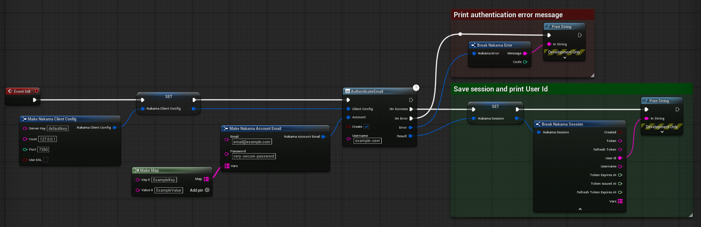

After you have created a default client you'll be able to setup one or more realtime clients (sockets) that interact with the server.

Drag out from the **NakamaClient** that you created earlier, and call the **Setup Realtime Client** function.

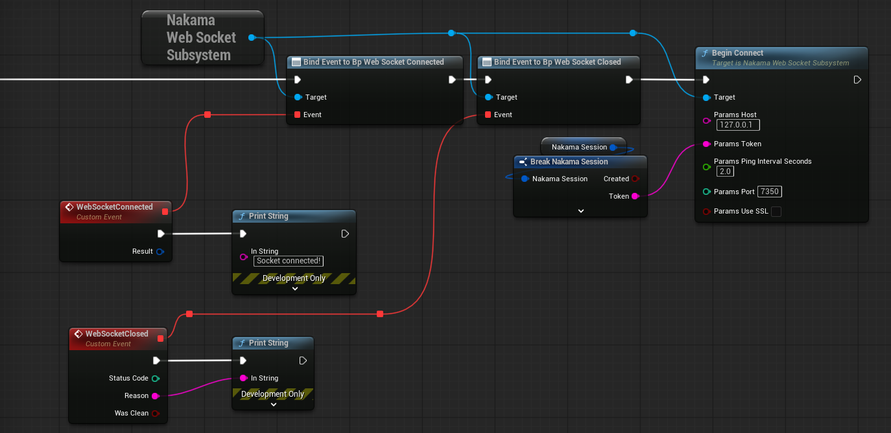

Remember to provide the user session from the successful authentication earlier, then bind custom events to the success and error callbacks. The Realtime Client will be returned from this node, and is ready to be used to communicate with the Nakama server. You can now use features such as Chat and Matchmaker.

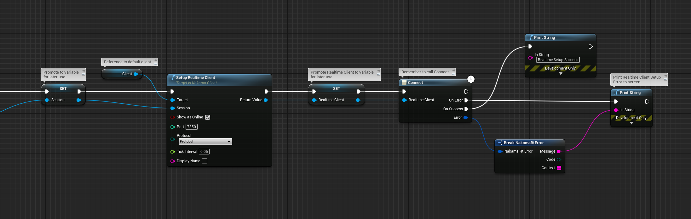

## Setting up Listeners and Binding to Events

After creating your Realtime Client you are ready to bind to its' events

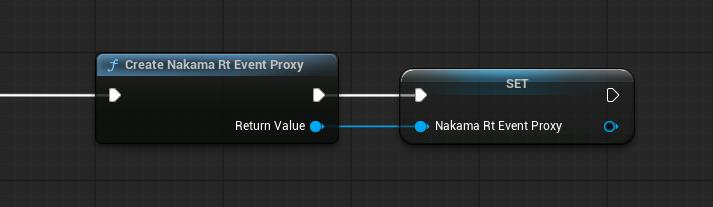

After setting up your specific listeners you are ready to bind to the callbacks.

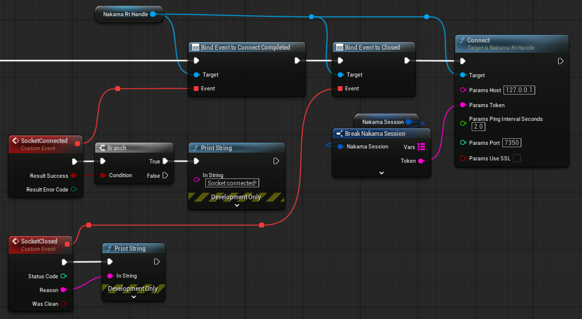

Create a custom event and give it a meaningful name.

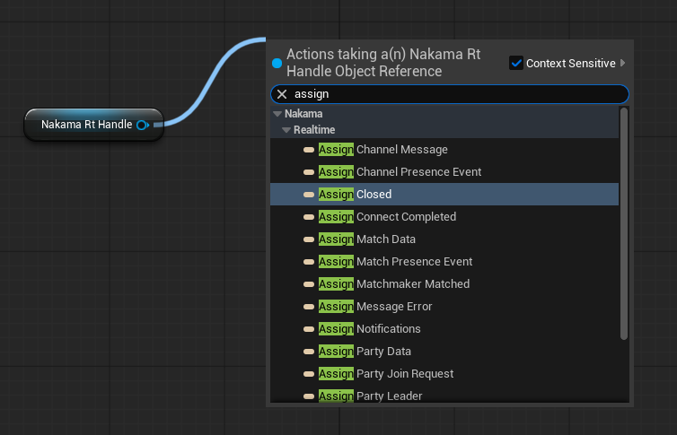

 In the example below, we setup a listener for notifications, then we bind to the event, loop over notifications and print them as debug strings on the screen.

 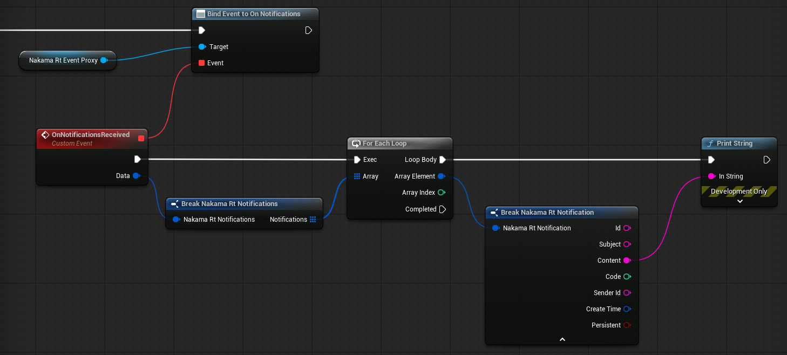

In the next example we listen to matchmaker matched event then bind to it and handle the response by joining a match with the returned token which then returns a Match including the match id, presences, label and so on.

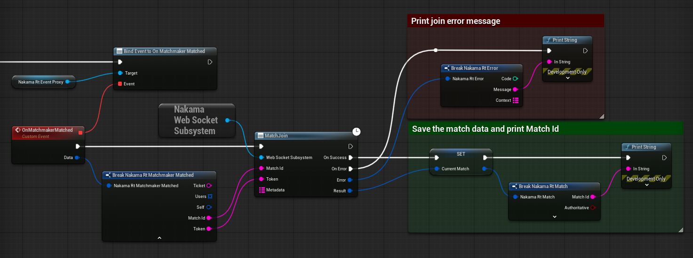


## Session Management

As described earlier, when you authenticate with Nakama you'll receive a Session struct which you should store somewhere easily accessible in your Blueprints, since many of the nodes in this plugin require a session as an input to function.

The session struct contains data readable in blueprints. Drag out from the session and break the struct.

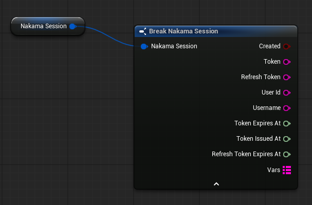

There are also some additional session management methods like restoring the session and checking if the session has expired

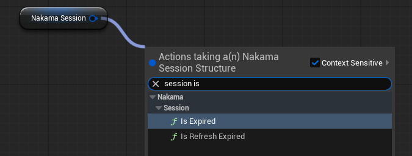


It is recommended to store the auth token from the session and check at startup if it has expired. If the token has expired you must reauthenticate. The expiry time of the token can be changed as a setting in the server.


## Requests

The client includes a lot of built-in APIs for various features of the game server. These can be accessed with the async methods, which returns Success and Error callbacks. They can also call custom logic as RPC functions on the server. All requests are sent with a session struct which authorizes the clients.

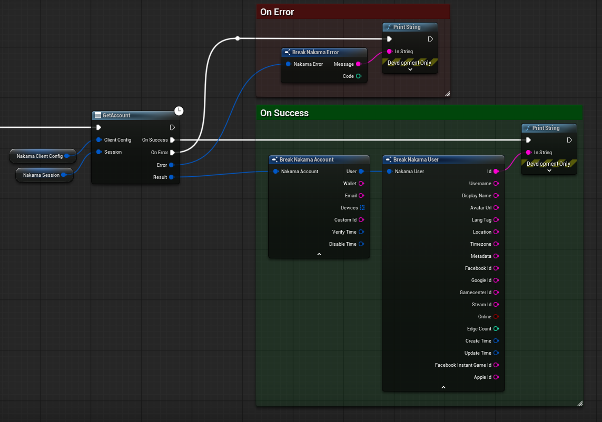

The RPC node can be used to run specific functionality on the server, the payload should be in JSON format.

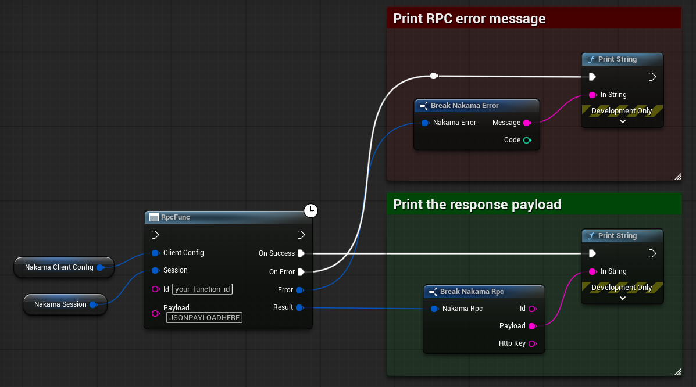

## Cursors

Cursors are used to add paging functionality to certain nodes, like friends list and leaderboard records. When there is more data to be retrieved, a cursor string will be returned in the Success callback. You can store this cursor as a string and use it later, like when a person clicks a "more" button or use it immediately to fetch more data. Look at the example below.

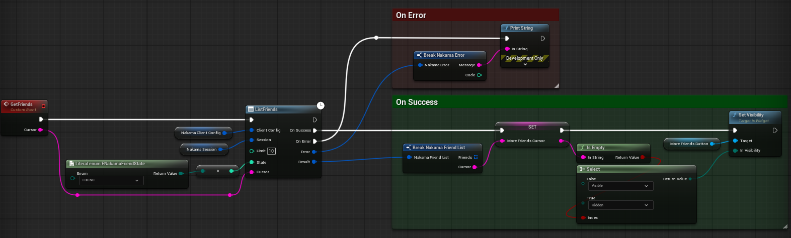

# Satori

Satori is a liveops server for games that powers actionable analytics, A/B testing, and remote configuration. Use the Satori Unreal Client to communicate with Satori from within your Unreal game.

Full documentation is online - https://heroiclabs.com/docs/satori/client-libraries/unreal

# Example Usage

1. Create the Satori Client Config using your desired connection credentials:

```cpp
const FString ServerKey = TEXT("apiKey");
const FString Host = TEXT("127.0.0.1");
constexpr int32 Port = 7450;
constexpr bool bUseSSL = false

const FSatoriClientConfig ClientConfig = FSatoriClientConfig{ServerKey, Host, Port, bUseSSL};

```

2. Authenticate using the previously created Satori Client Config along with a unique ID for the user:

```cpp
FSatoriSession Session;

const FString Id = FGuid::NewGuid().ToString(EGuidFormats::DigitsWithHyphens);
constexpr bool bNoSession = false;
const TMap<FString, FString> Default = {};
const TMap<FString, FString> Custom = {};

Satori::Authenticate(ClientConfig, Id, bNoSession, Default, Custom).Next(
    [&Session](const FSatoriSessionResult& SessionResult)
    {
       if (SessionResult.bIsError)
       {
          UE_LOG(LogTemp, Error, TEXT("Error authenticating: {%d} %s"), SessionResult.Error.Code,
                 *SessionResult.Error.Message);
          return;
       }

       Session = SessionResult.Value;

       UE_LOG(LogTemp, Log, TEXT("Session has token: %s"), *Session.Token);
       UE_LOG(LogTemp, Log, TEXT("Session has refresh token: %s"), *Session.RefreshToken);
    });

```

3. Once the user is authenticated, you can start making API requests by passing in both the Satori Client Config, and the session that was received from authentication:

```cpp
Satori::ListProperties(ClientConfig, Session).Next(
    [](const FSatoriPropertiesResult& ListPropertiesResult)
    {
       if (ListPropertiesResult.bIsError)
       {
          UE_LOG(LogTemp, Error, TEXT("Error listing properties: {%d} %s"),
                 ListPropertiesResult.Error.Code,
                 *ListPropertiesResult.Error.Message);
          return;
       }

       for (TTuple Property : ListPropertiesResult.Value.Default)
       {
          UE_LOG(LogTemp, Log, TEXT("Default Property found: %s with value %s"),
                 *Property.Key, *Property.Value);
       }

       for (TTuple Property : ListPropertiesResult.Value.Custom)
       {
          UE_LOG(LogTemp, Log, TEXT("Custom Property found: %s with value %s"), *Property.Key,
                 *Property.Value);
       }

       for (TTuple Property : ListPropertiesResult.Value.Computed)
       {
          UE_LOG(LogTemp, Log, TEXT("Computed Property found: %s with value %s"),
                 *Property.Key, *Property.Value);
       }
    });

```

## Installing the Plugin

To use Satori in your Unreal project, you'll need to copy the Satori Client files you downloaded into the appropriate place:

1. Open your Unreal project folder (for example, `C:\\MyUnrealProject\\`) in Explorer or Finder.
2. If one does not already exist, create a `Plugins` folder here.
3. Copy the `Satori` folder from the root of the downloaded release zip and put it in the `Plugins` folder.

**Optionally:** you can put the plugin inside your Unreal Engine plugin folder (for example, `C:\Program Files\Epic Games\UE_4.26\Engine\Plugins\`) to use the plugin across multiple projects.

Remember to add the modules to the dependencies under your project's Build.cs file. For example:

```cs
PublicDependencyModuleNames.AddRange(new string[] { "Satori", "SatoriApi", "SatoriBlueprints" });
```

At this point, you are done. Restart Unreal. After it compiles everything, open Edit->Plugins, then search for "Satori". If all went well, you should see the Satori plugin, make sure to enable it (this may prompt an editor restart).

# Development

## Task Automation

This project uses [Taskfile](https://taskfile.dev/) to automate common development tasks. Taskfile provides a consistent interface for building, testing, and deploying the project across different platforms and environments.

### Why Taskfile?

- **Consistency**: GitHub Actions and local development use the same tasks, ensuring what works locally will work in CI/CD
- **Easy Verification**: You can run the exact same commands locally that run in CI/CD pipelines
- **Cross-Platform**: Works consistently on macOS, Linux, and Windows
- **Simple Syntax**: YAML-based configuration that's easy to read and maintain
- **Heroic Standard**: Consistent across Heroic products

### Installation

#### macOS
```shell
brew install go-task
```

Or using the install script:
```shell
sh -c "$(curl --location https://taskfile.dev/install.sh)" -- -d -b /usr/local/bin
```

#### Windows
```powershell
# Using Chocolatey
choco install go-task

# Using Scoop
scoop install task

# Using Winget
winget install Task.Task
```

#### Linux
```shell
# Using Snap
snap install task --classic

# Using install script
sh -c "$(curl --location https://taskfile.dev/install.sh)" -- -d -b ~/.local/bin
```

## Available Tasks

Run `task --list` to see all available tasks. 

### Testing

The client provides a test suite that comes as an Unreal Project that can be found under `IntegrationTests/`. 
To build and run the test project in headless mode, you can issue this command:

```powershell
task test
```

## Contribute

The development roadmap is managed as GitHub issues and pull requests are welcome. If you're interested in enhancing the code please open an issue to discuss the changes or drop in and discuss it in the [community forum](https://forum.heroiclabs.com).

## License

This project is licensed under the [Apache-2 License](https://github.com/heroiclabs/nakama-unreal/blob/master/LICENSE).
