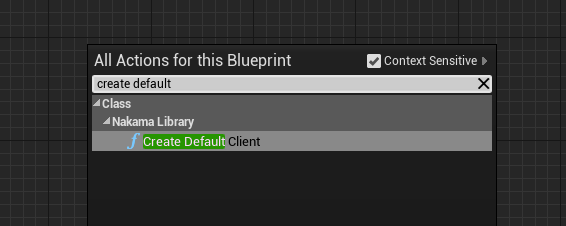
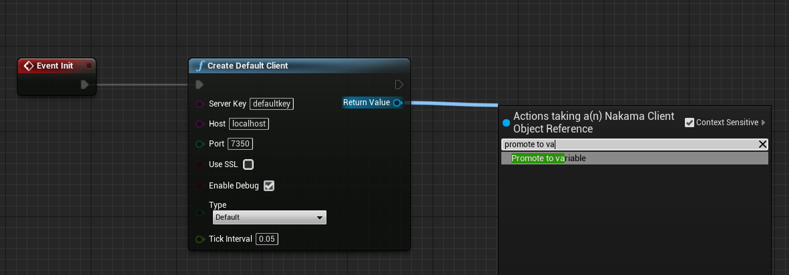
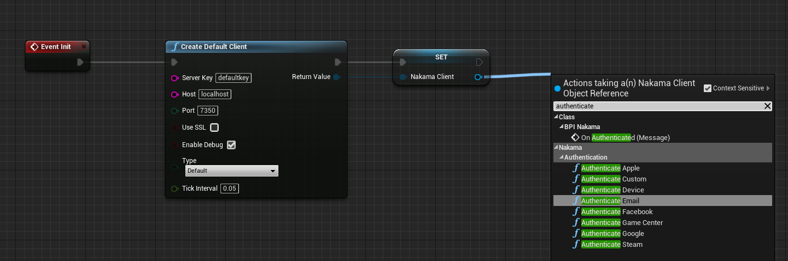
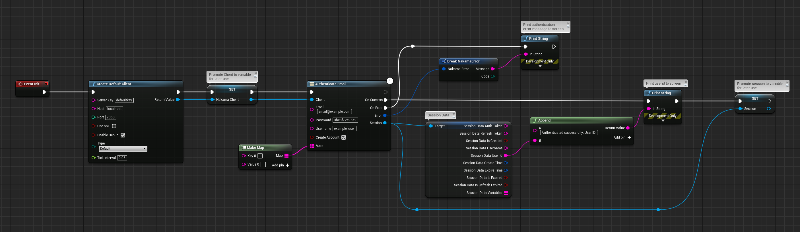
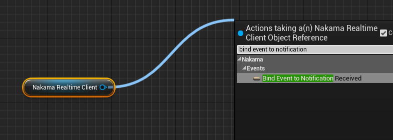
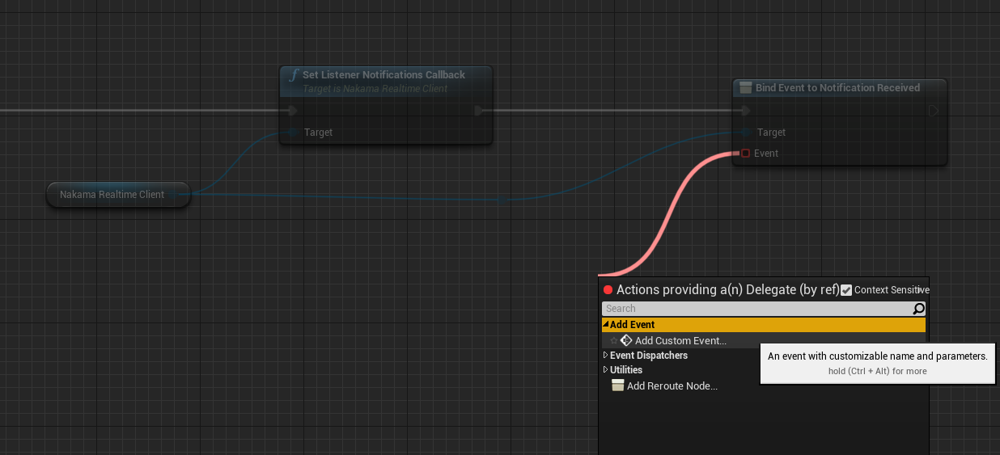
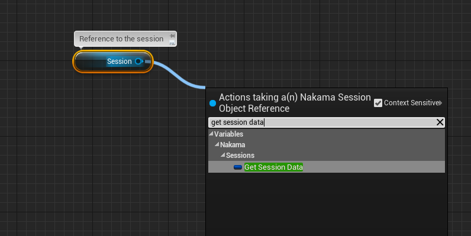
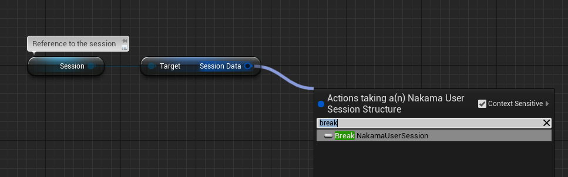
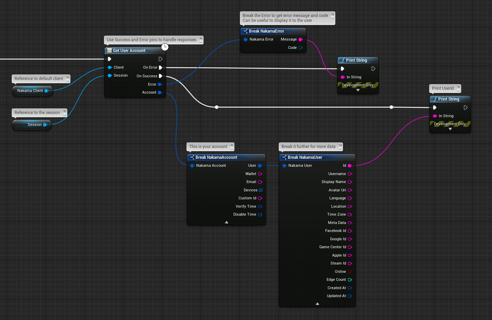

 Nakama Unreal
=============

[Nakama](https://github.com/heroiclabs/nakama) is an open-source server designed to power modern games and apps. Features include user accounts, chat, social, matchmaker, realtime multiplayer, and much [more](https://heroiclabs.com).

This client implements the full API and socket options with the server. It's written in C++ with minimal dependencies to support Unreal 4 and 5.

If you experience any issues with the client, it can be useful to enable debug logs and [open an issue](https://github.com/heroiclabs/nakama-cpp/issues).

Full documentation is online - https://heroiclabs.com/docs

# General Information

This plugin can also be used for programmers who like C++ or Blueprints. All variables and functions are exposed to types used by Unreal Engine (UPROPERTIES, USTRUCT, UFUNCTIONS etc.)

The plugin is divided into three modules which can be pulled in depending on your needs.

- `NakamaUnreal` The recommended C++ based module for using Nakama in UnrealEngine. This integrates with Unreal's native types and UObjects.
- `NakamaBlueprints` For users who would prefer to use Blueprints in their project.
- `NakamaCore` For users who are migrating from our old Unreal client and want to make minimal changes, or use our lower-level C++ API without Unreal types: (https://github.com/heroiclabs/nakama-cpp)

Clients are referred in this documentation as **Realtime Client** and **Default Client** in which the realtime client is the socket and the default client is using REST API to communicate with Nakama.

# Getting Started

You'll need to setup the server and database before you can connect with the client. The simplest way is to use Docker but have a look at the [server documentation](https://github.com/heroiclabs/nakama#getting-started) for other options.

To get started using Nakama in Unreal you will need the following:

1. Install and run the servers. Follow these [instructions](https://heroiclabs.com/docs/install-docker-quickstart).
2. A copy of the core [Nakama Unreal](https://github.com/heroiclabs/nakama-unreal) plugin
3. [Unreal Engine](https://www.unrealengine.com) 4.25 or greater or 5.
4. A compiler for the platform you are developing on, such as [Visual Studio](https://www.visualstudio.com/vs/community/) on Windows or [XCode](https://developer.apple.com/xcode/download/) on OSX.

Also, please ensure your Unreal project is a C++ project.  If it is Blueprint only, you can add a new C++ file to your project in Unreal Editor via "File -> New C++ Class".  Set it private and name it whatever you like.  Having this file in your project lets Unreal compile the plugin.

## Installing the Plugin

To use Nakama in your Unreal project, you'll need to download our plugin from the Unreal Marketplace or copy the nakama-unreal files you downloaded into the appropriate place. To do the latter:

1. Open your Unreal project folder (for example, `C:\\MyUnrealProject\\`) in Explorer or Finder.
2. If one does not already exist, create a `Plugins` folder here.
3. Copy the `Nakama` folder from [nakama-unreal](https://github.com/heroiclabs/nakama-unreal/releases) and put it in the `Plugins` folder

**Optionally:** you can put the plugins inside your Unreal Engine plugin folder (for example, `C:\Program Files\Epic Games\UE_4.26\Engine\Plugins\Marketplace`) to use the plugin on multiple projects.

At this point, you are done. Restart Unreal. After it compiles things, open Edit->Plugins and scroll to the bottom. If all went well, you should see HeroicLabs.Nakama listed as a plugin.

 **Clients**

You have to decide where you want to create and keep record of these clients.

 **Sessions**

 Sessions are portable UObjects that contain a session pointer and a struct with the actual data in the session, like the tokens, user data, expiry information an so on. There are also some utility functions provided with the Session objects, like getting a specific variable or restoring the session.

  **Tick System**

Normally you would have to handle ticking on a C++ basis, luckily this is done automatically under the hood in this plugin after you have created the client. When you create the Client you can define a Tick Interval, by default this is set to 0, which means it will tick every frame, if you want it to tick every 50ms you have to set it as 0.05, to make it tick every second this number would be 1.

# Getting Started with NakamaUnreal (C++ with Unreal Types)

Below is a simple example of setting up a default client, authenticating, setting up a realtime client and joining a chat room. In the example we will put everything in a empty AActor class that is placed in the level.

Remember to add NakamaUnreal and NakamaCore to your Private Dependencies under your project Build.cs file. For example:

```cs

PrivateDependencyModuleNames.AddRange(new string[] { "NakamaUnreal", "NakamaCore" });

```

Starting with the headers public variables, we are using a blank actor that will be placed in the scene in this example. Unreal Engine uses a reflection system that provides metadata about its classes and allows for advanced features like Blueprint/C++ communication, serialization, and more.
When working with Nakama objects, or any UObject-derived class, it's crucial to mark them using the Unreal reflection system. This is done using macros such as UFUNCTION(), and UPROPERTY(). 

```cpp
UPROPERTY()
UNakamaClient* NakamaClient;

UPROPERTY()
UNakamaRealtimeClient* NakamaRealtimeClient;

UPROPERTY()
UNakamaSession* UserSession;

UFUNCTION()
void OnAuthenticationSuccess(UNakamaSession* LoginData);

UFUNCTION()
void OnAuthenticationError(const FNakamaError& Error);

UFUNCTION()
void OnRealtimeClientConnectSuccess();

UFUNCTION()
void OnRealtimeClientConnectError();

// Initialize client and authenticate here
virtual void BeginPlay() override;
```

For instance, if you want a Nakama object to be available for manipulation within the Blueprint Editor, you'd mark it with UPROPERTY().

```cpp
UPROPERTY(BlueprintReadWrite, EditAnywhere, Category="Nakama")
UNakamaClient* NakamaClientInstance;
```

By using the BlueprintReadWrite specifier, the NakamaClientInstance variable becomes both readable and writable in Blueprints.

Then inside the Begin Play we setup default client, authenticate and bind delegates.

```cpp
// Called when the game starts or when spawned
void AMyActor::BeginPlay()
{
	Super::BeginPlay();

	// Default Client Parameters
	FString ServerKey = TEXT("defaultkey");
	FString Host = TEXT("127.0.0.1");
	int32 Port = 7350;
	bool bUseSSL = false;
	bool bEnableDebug = true;

	// Setup Default Client
	NakamaClient = UNakamaClient::CreateDefaultClient(ServerKey, Host, Port, bUseSSL, bEnableDebug);

	// Authentication Parameters
	FString Email = TEXT("debug@mail.com");
	FString Password = TEXT("verysecretpassword");
	FString Username = TEXT("debug-user");
	TMap<FString, FString> Variables;

	// Setup Delegates of same type and bind them to local functions
	FOnAuthUpdate AuthenticationSuccessDelegate;
	AuthenticationSuccessDelegate.AddDynamic(this, &AMyActor::OnAuthenticationSuccess);

	FOnError AuthenticationErrorDelegate;
	AuthenticationErrorDelegate.AddDynamic(this, &AMyActor::OnAuthenticationError);

	NakamaClient->AuthenticateEmail(Email, Password, Username, true, Variables, AuthenticationSuccessDelegate, AuthenticationErrorDelegate);
}
```

Then the response of the authentication callbacks

```cpp
void AMyActor::OnAuthenticationSuccess(UNakamaSession* LoginData)
{
	if(GEngine) GEngine->AddOnScreenDebugMessage(-1, 15.0f, FColor::Green, FString::Printf(TEXT("Authenticated As %s"), *LoginData->SessionData.Username));

	UserSession = LoginData;

	// Setup Delegates of same type and bind them to local functions
	FOnRealtimeClientConnected ConnectionSuccessDelegate;
	ConnectionSuccessDelegate.AddDynamic(this, &AMyActor::OnRealtimeClientConnectSuccess);

	FOnRealtimeClientError ConnectionErrorDelegate;
	ConnectionErrorDelegate.AddDynamic(this, &AMyActor::OnRealtimeClientConnectError);

	// This is our realtime client (socket) ready to use
	NakamaRealtimeClient = NakamaClient->SetupRealtimeClient();

	// Remember to Connect
	bool bCreateStatus = true;
	NakamaRealtimeClient->Connect(UserSession, bCreateStatus, ConnectionSuccessDelegate, ConnectionErrorDelegate);

}

void AMyActor::OnAuthenticationError(const FNakamaError& Error)
{
	if(GEngine) GEngine->AddOnScreenDebugMessage(-1, 15.0f, FColor::Red, FString::Printf(TEXT("Failed to Authenticate: %s"), *Error.Message));
}
```

And finally the overridden realtime client setup callback, you can now use the realtime client.

```cpp
void AMyActor::OnRealtimeClientConnectSuccess()
{
	if(GEngine) GEngine->AddOnScreenDebugMessage(-1, 15.0f, FColor::Green, FString(TEXT("Socket Setup Success!")));

	// Example of Joining Chat without callbacks
	NakamaRealtimeClient->JoinChat("Heroes", ENakamaChannelType::ROOM, true, false, {}, {});

}

void AMyActor::OnRealtimeClientConnectError()
{
	if(GEngine) GEngine->AddOnScreenDebugMessage(-1, 15.0f, FColor::Red, FString(TEXT("Socket Setup Failed!")));
}
```

If you setup everything correctly, create a blueprint version of this actor and place it in the level you will see on-screen messages saying you authenticated, your username and then socket connected message.

# Delegates and Lambdas in Nakama Unreal

The latest Nakama Unreal release offers the flexibility to use either `Dynamic Multicast Delegates` or `Lambdas (TFunctions)` for handling functions and events. Here's a brief comparison and guidelines on how to use them:

## Dynamic Multicast Delegates:
- **Binding**: Bound using `AddDynamic`.
- **Usage**: Suited for scenarios where multiple bindings are needed.

## Lambdas (TFunctions):
- **Binding**: Defined in-line and don't require an external function.
- **Usage**: Convenient for one-off or temporary handlers. Note that a lambda can only be bound to one place at a time.

### How to Choose?
Provide your preferred callback type (either a `delegate` or a `lambda`) into the `Success` and `Error` parameters of the relevant Nakama function.

---

## Example: Using Lambdas

Here's a demonstration of using `lambdas` as an alternative to `delegates`:

```cpp
// Define success callback with a lambda
auto successCallback = [&](UNakamaSession* session)
{	
	UE_LOG(LogTemp, Warning, TEXT("Session Token: %s"), *Session->GetAuthToken());
	UE_LOG(LogTemp, Warning, TEXT("Username: %s"), *Session->GetUsername());
};

// Define error callback with a lambda
auto errorCallback = [&](const FNakamaError& Error)
{
	UE_LOG(LogTemp, Warning, TEXT("Error Code: %d"), Error.Code);
};

// Execute the AuthenticateEmail function with lambdas
Client->AuthenticateEmail(TEXT("debug@mail.com"), TEXT("verysecretpassword"), TEXT("debug-user"), true, {}, successCallback, errorCallback);
```


# Working with Realtime Events

Upon initializing your Realtime Client, it's essential to establish event listeners for critical in-game events, ranging from channel messages and notifications to party interactions. Nakama Unreal provides flexibility by allowing both lambdas and delegates for this purpose. 

```cpp
// Start by creating a Realtime Client:
UNakamaRealtimeClient* Socket = NakamaClient->SetupRealtimeClient();

// When using delegates, you need to declare functions that match the delegate's signature:
Socket->ChannelMessageReceived.AddDynamic(this, &ANakamaActor::OnChannelMessageReceived);
Socket->NotificationReceived.AddDynamic(this, &ANakamaActor::OnNotificationReceived);

// Lambdas offer a concise way to define event handlers directly in-line:
// Note: A lambda can be bound only once.
Socket->SetChannelMessageCallback( [](const FNakamaChannelMessage& ChannelMessage)
{
	UE_LOG(LogTemp, Warning, TEXT("Channel Message: %s"), *ChannelMessage.Content);
});

Socket->SetNotificationsCallback( [](const FNakamaNotificationList& NotificationList)
{
	UE_LOG(LogTemp, Warning, TEXT("Notifications: %d"), NotificationList.Notifications.Num());
	for (auto& Notification : NotificationList.Notifications)
	{
		UE_LOG(LogTemp, Warning, TEXT("Notification: %s"), *Notification.Content);
	}
});

// Establish a connection to start receiving events. 
// Optional success and error callbacks (either lambdas or delegates) can be provided:
Socket->Connect(Session, true);
```
Function implementations might look something like this:


```cpp
void ANakamaActor::OnChannelMessageReceived(const FNakamaChannelMessage& ChannelMessage)
{
	UE_LOG(LogTemp, Warning, TEXT("Channel Message: %s"), *ChannelMessage.Content);
}

void ANakamaActor::OnNotificationReceived(const FNakamaNotificationList& Notifications)
{
	for (auto NotificationData : Notifications.Notifications)
	{
		UE_LOG(LogTemp, Warning, TEXT("Notification: %s"), *NotificationData.Content);
	}
}
```

# Getting Started with `NakamaBlueprints`

In this section you will learn how to manually create and manage Nakama clients that are provided by this plugin, entirely in blueprints.

It is up to the you where to create and store references to the clients, this could be done in any actor, component, character, gamemode etc. A good place to put the clients is in the Player Controller or the Game Instance.


Start by adding the **Create Default Client** node which is a part fo the Nakama Library.



It is good practice to promote the clients to variables so you can access them other places in your blueprint graphs.




You are now ready to authenticate, using one of the many provided Nakama authentication types, in this example we will be authenticating with email and password, normally you would setup a Widget Blueprint and pass the input from the UI into the authentication node, and authenticate by pressing a login button.




As you can see, this returns a session object that will be passed into other functions, make sure to promote the session object for later use. With this plugin you may have multiple sessions per unreal instance, it is up to you to keep record and decide how you want to use the sessions. The variables pin also needs to be connected, but you can leave the string map empty if you don't want to use custom variables.




After you have created a default client you'll be able to setup one or more realtime clients (sockets) that interact with the server.

Drag out from the **NakamaClient** that you created earlier, and call the **Setup Realtime Client** function.


Remember to provide the user session from the successful authentication earlier, then bind custom events to the success and error callbacks. The Realtime Client will be returned from this node, and is ready to be used to communicate with the Nakama server. You can now use features such as Chat and Matchmaker.


# Setting up Listeners and Binding to Events

After creating your Realtime Client you are ready to bind to its' events


After setting up your specific listeners you are ready to bind to the callbacks.



Create a custom event and give it a meaningful name.



 In the example below, we setup a listener for notifications, then we bind to the event, loop over notifications and print them as debug strings on the screen.

 

In the next example we listen to matchmaker matched event then bind to it and handle the response by joining a match with the returned token which then returns a Match including the match id, presences, label and so on.


# Session Management

As described earlier, when you authenticate with Nakama you'll receive a Session Object which you should store somewhere easily accessible in your Blueprints, since many of the nodes in this plugin require a session object as input to function.

The session object contains the actual session reference and also a structure with the data readable in blueprints. Drag out from the session and get the session data.



There are also some additional session management methods like restoring the session and checking if the session has expired




It is recommended to store the auth token from the session and check at startup if it has expired. If the token has expired you must reauthenticate. The expiry time of the token can be changed as a setting in the server.


# Requests

The clients include lots of builtin APIs for various features of the game server. These can be accessed with the async methods, which returns Success and Error callbacks. They can also call custom logic as RPC functions on the server. All requests are sent with a session object which authorizes the clients.



The RPC node can be used to run specific functionality on the server, the payload should be in JSON format.


Moving forward, you should be ready to use all functionality of Nakama to power your awesome Unreal Engine built game or app, done entirely in Blueprints. Please refer to the official documentation at https://heroiclabs.com/docs even though some of the documentation is described in C++ the same core functionality applies to the Blueprint implementation.


# Cursors

Cursors are used to add paging functionality to certain nodes, like friends list and leaderboard records. When there is more data to be retrieved, a cursor string will be returned in the Success callback. You can store this cursor as a string and use it later, like when a person clicks a "more" button or use it immediately to fetch more data. Look at the example below.


# Logging
By default, logging is disabled. However, when creating a Client, you have the option to `Enable Debug`, allowing logs to be written using the debug log category. You can also manually control logging.

**Enabling Logging from Blueprints:**


**Enabling Logging from C++**

To enable logging through C++, include the following header file:

```cpp
#include "NakamaLogger.h"
```
Subsequently, to toggle logging, use:

```cpp
UNakamaLogger::EnableLogging(true);
```
To set the log level, use:


```cpp
UNakamaLogger::SetLogLevel(ENakamaLogLevel::Debug);
```

Log categories are as follows:

- `Debug` writes all logs.

- `Info` writes logs with `Info`, `Warn`, `Error` and `Fatal` logging level.

- `Warn` writes logs with `Warn`, `Error` and `Fatal` logging level.

- `Error` writes logs with `Error` and `Fatal` logging level.

- `Fatal` writes only logs with `Fatal` logging level.

# Running Tests
This repository includes a test-suite to test the various features of Nakama for Unreal, tests can be run in the Editor, from Command-Line and there is eve a `BlueprintsTest` project with separate documentation if you would like to run the same tests in Blueprints.


## Using the Editor
- Create a blank C++ Project
- Add `Nakama` plugin to `Plugins` directory within the project
- Build and open the project in the Unreal Editor
- Be sure to enable the `Functional Testing Editor` Plugin in Unreal under `Edit -> Plugins` then restart the editor
- Navigate to `Tool -> TestAutomation`
- Select your device on the left hand side, navigate to the Automation tab then choose which Nakama Tests you would like to run and click `Start Tests`
- Logs will be provided with the result of the tests


## Using Command-Line:

The tests can be run in both packaged and using the command-line version of the Unreal Editor.

For all Command-Line based tests start by doing these steps:
- Create a blank C++ Unreal Engine Project with your desired editor version, this documentation focuses on Unreal Engine 5.0+
- Place the `Nakama` plugin in the `Plugins` directory within the project
- Enable the `Nakama` Plugin for the project
- You can either build the project like normal, or use the build commands below

**Windows - Editor:**

To build the test, run:
```bash
"<Path_To_Unreal_Engine>\Engine\Build\BatchFiles\Build.bat" <YourProjectName>Editor Win64 Development -Project="<Path_To_Your_Project>\<YourProjectName>.uproject"
```
To run the test, run:
```bash
"<Path_To_Unreal_Engine>\Engine\Binaries\Win64\UnrealEditor-Cmd.exe" "<Path_To_Your_Project>\<YourProjectName>.uproject" -ExecCmds="Automation RunTests <YourTestName>" -log -NullRHI -verbose -unattended -ReportOutputPath="<Path_To_Store_Report>"
```

If you want to run all tests replace `<YourTestName>` with `Nakama.Base`, if you specify `ReportOutputPath` you will receive an overview json logfile, logs will be stored within the `Saved/Logs` directory.

**Windows - Packaged:**

To build the test, run:
```bash
"<Path_To_Unreal_Engine>/Engine/Build/BatchFiles/RunUAT.sh" BuildCookRun -targetconfig=Debug -project="<Path_To_Your_Project>\<YourProjectName>.uproject" -noP4 -installed -utf8output -build -cook -stage -package -verbose -stdout -nohostplatform -useshellexecute
```
To run the test, run:
```bash
./<YourProjectName>/Saved/StagedBuilds/Windows/<YourProjectName>.exe -nullrhi -verbose -ExecCmds="Automation RunTests Nakama.Base" -log
```

**Mac - Packaged:**

To build the test, run:
```bash
"<Path_To_Unreal_Engine>/Engine/Build/BatchFiles/RunUAT.sh" BuildCookRun -project="<Path_To_Your_Project>\<YourProjectName>.uproject" -targetConfig=Debug -noP4 -platform=Mac -Architecture_Mac=arm64 -targetconfig=Debug -installed -unrealexe=UnrealEditor -utf8output -build -cook -stage -package -verbose
```

To run the test, run:
```bash
./<YourProjectName>/Binaries/Mac/<YourProjectName>.app/Contents/MacOS/<YourProjectName> -nullrhi -stdout -forcelogflush -ExecCmds="Automation RunTests Nakama.Base" -log
```

**Linux - Packaged:**

To build the test, run:
```bash
"<Path_To_Unreal_Engine>/Engine/Build/BatchFiles/RunUAT.sh" BuildCookRun -project="<Path_To_Your_Project>\<YourProjectName>.uproject" -clientconfig=Test -noP4 -platform=Linux -targetconfig=Debug -installed  -utf8output -build -cook -stage -package -verbose
```
To run the test, run:
```bash
./<YourProjectName>/Binaries/Linux/<YourProjectName> -nullrhi -stdout -forcelogflush -ExecCmds="Automation RunTests Nakama.Base" -log
```

**Passing Parameters**

Parameters such as hostname, port and server key can be passed as command-line arguments, here is an example:

```bash
-hostname="127.0.0.1" -port=7350 -serverkey="defaultkey" -serverhttpkey="defaulthttpkey" -timeout=45 -useSSL
``` 

# Additional Information

Some of the features of this plugin depend on JSON, such as sending chat messages and storing data using storage objects. It is therefore recommended that if you use purely blueprints that you find a plugin that can construct and parse Json strings such as [VaRest](https://github.com/ufna/VaRest).

When you are developing within the editor, you can run multiple unreal instances using PIE (Play In Editor) and are able to authenticate using separate accounts, which is very useful when testing functionalities that require multiple players, such as chat, realtime multiplayer, matchmaking and so on.

In the installation part of this documentation we add C++ to our project, this is only to be able to compile the plugin, you can still use only Blueprints.


# Example Project

Provided with this plugin is an [example project](https://github.com/heroiclabs/nakama-unreal/tree/master/NakamaBlueprintsDemo) which is developed in pure Blueprints that showcases almost all of the Nakama core features.


## Contribute

The development roadmap is managed as GitHub issues and pull requests are welcome. If you're interested to enhance the code please open an issue to discuss the changes or drop in and discuss it in the [community forum](https://forum.heroiclabs.com).

## Source Builds

The Unreal module is based on [General C++ SDK](https://github.com/heroiclabs/nakama-cpp)

We use vcpkg to install nakama-sdk for any given toolchain before placing it in the `NakamaCore/libnakama` directory:

arm64-osx:
`vcpkg install --overlay-triplets=./triplets --host-triplet=arm64-osx-release-heroic --triplet=arm64-osx-release-heroic`

x64-windows:
`vcpkg install --overlay-triplets=./triplets --host-triplet=x64-windows-heroic --triplet=x64-windows-heroic`

arm64-windows:
`vcpkg install --overlay-triplets=./triplets --host-triplet=arm64-windows-heroic --triplet=arm64-windows-heroic`

x64-linux:
`vcpkg install --overlay-triplets=./triplets --host-triplet=x64-linux-release-heroic --triplet=x64-linux-release-heroic`

Then copy the library from vcpkg_installed into the libnakama directory and the headers to `NakamaCore/Public/nakama-cpp`.

You can then compile the plugin from the command line, passing the `-Rocket` flag if you intalled the editor through
the Epic launcher. However, using an Epic launcher distribution is not recommended at least for running the command line.

Windows:

```bash
${UNREAL_ENGINE}/Engine/Build/BatchFiles/RunUAT.sh BuildPlugin -NoHostPlatform -Plugin="${NAKAMA_UNREAL}/Nakama/Nakama.uplugin" -TargetPlatforms=Win64 -package=${NAKAMA_UNREAL}/Out/Nakama
```

Mac:

```bash
${UNREAL_ENGINE}/Engine/Build/BatchFiles/RunUAT.sh BuildPlugin -NoHostPlatform -Plugin="${NAKAMA_UNREAL}/Nakama/Nakama.uplugin" -TargetPlatforms=Mac -package=${NAKAMA_UNREAL}/Out/Nakama -Architecture_Mac=arm64
```

For iOS, pass `iOS` to `TargetPlatforms`.

To view the full list of automation commands, run:

`${UNREAL_ENGINE}/Engine/Build/BatchFiles/RunUAT.sh -List`

Linux:

```${UNREAL_ENGINE}/Engine/Build/BatchFiles/RunUAT.sh BuildPlugin -NoHostPlatform -Plugin="${NAKAMA_UNREAL}/Nakama/Nakama.uplugin" -TargetPlatforms=Linux -package=${NAKAMA_UNREAL}/Out/Nakama```

### Nakama Unreal Client guide

You can find Nakama Unreal Client guide [here](https://heroiclabs.com/docs/unreal-client-guide/).

## License

This project is licensed under the [Apache-2 License](https://github.com/heroiclabs/nakama-dotnet/blob/master/LICENSE).
